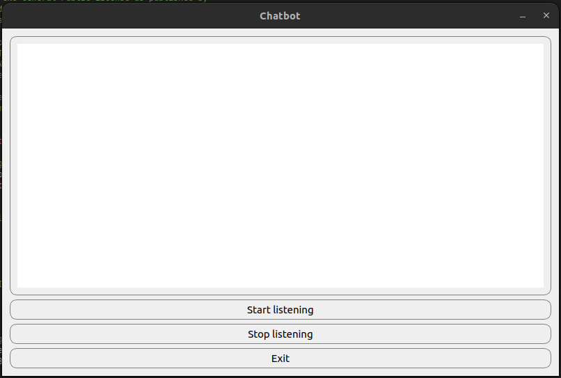

# Chatbot App

Im Bild sieht man ein Chatfenster, mit dem man mit einem KI-Modell kommuniziert.



## Pakete installieren

Um alle Pakete, die für dieses Projekt benötigt werden, herunterzuladen, wird die Datei "requirements" verwendet.

```shell
pip install -r requirements.txt
```

## App starten:

```shell
python bot.py
```

## App buttons:

- Start listening: Das Skript beginnt, Sie aufzuzeichnen, Sie müssen nach dem Drücken der Taste sprechen.
- Stop listening: Das Skript stoppt die Aufnahme
- Exit: Das Skript stoppt
